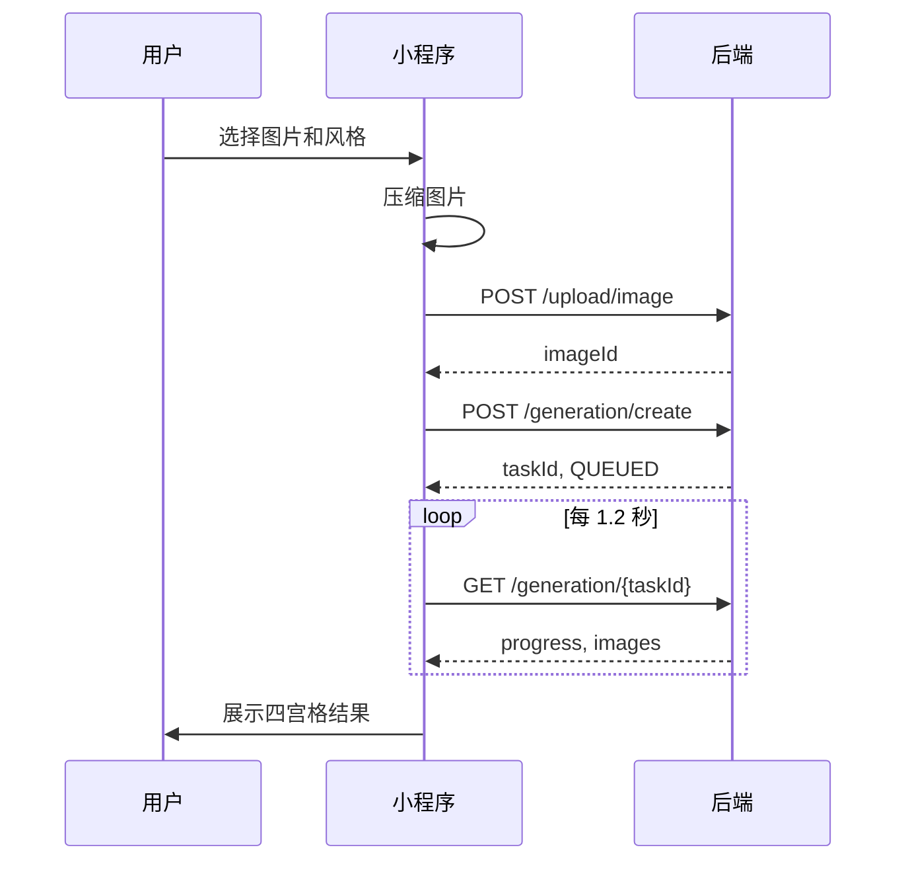

# AI影像写真馆前端架构文档

版本：MVP 研发版  
技术栈：Taro + React + TypeScript + Zustand + React Query + NutUI  
目标平台：微信小程序  
AI 调用原则：前端不直接调用 KL API，只调用业务后端接口。

## 1. 前端目标

前端负责完整小程序体验：微信登录、首页、风格选择、照片上传与压缩、协议确认、生成进度、结果四宫格、保存分享、次数购买、激励广告、我的页面和合规页面。

核心体验约束：

- 首页即展示产品价值和剩余次数。
- 图片上传前在端上压缩，目标 2MB 内。
- 风格固定四种，默认支持“一键生成四风格”。
- 生成任务采用异步轮询，支持部分成功展示。
- 支付和广告奖励均以后端确认为准。
- 界面遵循 `Warm Amber Minimalism`：`#FFB800`、`#FFF5E8`、`#FF7D45`、`#F8F8F8`、`#222222`。

## 2. 页面映射

| Figma Node | 页面名称 | Taro 路由 | 页面职责 | 主要组件 | 依赖 API | Store | 埋点事件 |
| --- | --- | --- | --- | --- | --- | --- | --- |
| 3306-893 | 启动页 | `/pages/splash/index` | 初始化登录、读取配置 | `BrandLogo`, `LoadingProgress` | `/auth/wechat-login` | UserStore | `app_launch` |
| 3306-927 | 首页 | `/pages/home/index` | 展示风格、次数、开始制作 | `CreditBadge`, `StylePreviewGrid` | `/credits`, `/packages` | UserStore, CreditStore | `home_view`, `start_click` |
| 3306-1016 | 风格选择页 | `/pages/style/index` | 选择单风格或四风格 | `StyleCard` | 无 | GenerationStore | `style_select` |
| 3306-1058 | 上传页 | `/pages/upload/index` | 选择相册/相机、压缩 | `UploadCard` | `/upload/image` | GenerationStore | `photo_choose`, `photo_upload` |
| 3306-1131 | 图片确认页 | `/pages/confirm/index` | 裁剪预览、重新选择 | `ImageCropPreview` | `/upload/validate` | GenerationStore | `photo_confirm` |
| 3306-1202 | 协议确认页 | `/pages/agreement/index` | 隐私和用户协议确认 | `AgreementCheckbox` | 无 | UserStore | `agreement_accept` |
| 3306-1287 | 生成中页 | `/pages/generating/index` | 创建任务、轮询进度 | `LoadingProgress`, `TaskStepList` | `/generation/create`, `/generation/{taskId}` | GenerationStore | `generation_create`, `generation_poll` |
| 3306-1392 | 结果页 | `/pages/result/index` | 四宫格结果、保存、分享 | `ResultImageCard` | `/generation/{taskId}` | GenerationStore | `result_view` |
| 3306-1421 | 图片预览页 | `/pages/preview/index` | 单图放大、保存相册 | `ImagePreview`, `PrimaryButton` | 无 | GenerationStore | `image_preview`, `image_save` |
| 3306-1931 | 保存成功页 | `/pages/save-success/index` | 保存成功反馈和分享引导 | `SuccessState`, `SharePosterCard` | `/share/create-poster` | GenerationStore | `save_success` |
| 3306-1856 | 分享海报页 | `/pages/share-poster/index` | 生成分享海报 | `SharePosterCard` | `/share/create-poster`, `/share/reward` | UserStore | `share_poster_view`, `share_send` |
| 3306-1791 | 点数购买页 | `/pages/purchase/index` | 套餐选择、拉起支付 | `PurchasePackageCard` | `/packages`, `/orders` | OrderStore, CreditStore | `purchase_view`, `order_create` |
| 3306-1707 | 激励广告页 | `/pages/ad-reward/index` | 看广告得次数 | `RewardAdPanel` | `/credits/reward-ad` | CreditStore | `ad_start`, `ad_complete` |
| 3306-1671 | 我的页面 | `/pages/profile/index` | 头像、次数、订单、协议入口 | `ProfileHeader`, `MenuList` | `/user/profile`, `/credits` | UserStore, CreditStore | `profile_view` |
| 3306-1605 | 订单记录页 | `/pages/orders/index` | 订单列表和状态 | `OrderList` | `/orders` | OrderStore | `orders_view` |
| 3306-1535 | FAQ 页面 | `/pages/faq/index` | 常见问题 | `FaqList` | 可静态 | 无 | `faq_view` |
| 3306-1462 | 隐私/用户协议页 | `/pages/legal/index` | 展示协议 | `LegalArticle` | 静态或 CMS | 无 | `legal_view` |

## 3. 项目目录

```text
src/
├── app.config.ts
├── app.tsx
├── pages/
│   ├── splash/
│   ├── home/
│   ├── style/
│   ├── upload/
│   ├── confirm/
│   ├── agreement/
│   ├── generating/
│   ├── result/
│   ├── preview/
│   ├── save-success/
│   ├── share-poster/
│   ├── purchase/
│   ├── ad-reward/
│   ├── profile/
│   ├── orders/
│   ├── faq/
│   └── legal/
├── components/
│   ├── PrimaryButton/
│   ├── StyleCard/
│   ├── UploadCard/
│   ├── CreditBadge/
│   ├── ResultImageCard/
│   ├── LoadingProgress/
│   ├── PurchasePackageCard/
│   ├── SharePosterCard/
│   ├── EmptyState/
│   └── ErrorState/
├── stores/
│   ├── user.store.ts
│   ├── credit.store.ts
│   ├── generation.store.ts
│   └── order.store.ts
├── services/
│   ├── request.ts
│   ├── auth.api.ts
│   ├── user.api.ts
│   ├── credit.api.ts
│   ├── upload.api.ts
│   ├── generation.api.ts
│   ├── order.api.ts
│   └── share.api.ts
├── hooks/
│   ├── useLogin.ts
│   ├── useCredits.ts
│   ├── useGenerationTask.ts
│   └── useRewardAd.ts
├── utils/
│   ├── image-compress.ts
│   ├── auth-token.ts
│   ├── env.ts
│   ├── tracker.ts
│   └── safe-area.ts
├── constants/
│   ├── styles.ts
│   ├── error-codes.ts
│   └── routes.ts
├── assets/
└── styles/
    ├── tokens.scss
    ├── mixins.scss
    └── global.scss
```

## 4. 路由配置

```ts
export default defineAppConfig({
  pages: [
    "pages/splash/index",
    "pages/home/index",
    "pages/style/index",
    "pages/upload/index",
    "pages/confirm/index",
    "pages/agreement/index",
    "pages/generating/index",
    "pages/result/index",
    "pages/preview/index",
    "pages/save-success/index",
    "pages/share-poster/index",
    "pages/purchase/index",
    "pages/ad-reward/index",
    "pages/profile/index",
    "pages/orders/index",
    "pages/faq/index",
    "pages/legal/index"
  ],
  window: {
    navigationStyle: "custom",
    backgroundColor: "#F8F8F8",
    backgroundTextStyle: "dark"
  },
  tabBar: {
    color: "#666666",
    selectedColor: "#FFB800",
    backgroundColor: "#FFFFFF",
    list: [
      { pagePath: "pages/home/index", text: "制作" },
      { pagePath: "pages/profile/index", text: "我的" }
    ]
  }
});
```

## 5. 状态管理

### UserStore

```ts
interface UserState {
  userId: string;
  openid: string;
  unionid?: string;
  nickname: string;
  avatar: string;
  token: string;
  refreshToken: string;
  isLogin: boolean;
  login: () => Promise<void>;
  logout: () => Promise<void>;
  refreshProfile: () => Promise<void>;
}
```

### CreditStore

```ts
interface CreditState {
  totalCredits: number;
  freeCredits: number;
  paidCredits: number;
  adCredits: number;
  giftCredits: number;
  todayAdCount: number;
  dailyAdLimit: number;
  fetchCredits: () => Promise<void>;
  consumeCredit: (taskId: string) => void;
  addAdCredit: (eventId: string) => Promise<void>;
  addPaidCredit: (orderId: string) => Promise<void>;
}
```

### GenerationStore

```ts
type StyleId = "pixar" | "realistic" | "handdrawn" | "comic";
type TaskStatus =
  | "CREATED"
  | "VALIDATING"
  | "UPLOADED"
  | "QUEUED"
  | "PROCESSING"
  | "PARTIAL_SUCCESS"
  | "SUCCESS"
  | "FAILED"
  | "TIMEOUT"
  | "CANCELLED"
  | "REFUNDED";

interface GenerationState {
  currentTaskId: string;
  uploadImageId: string;
  uploadImageUrl: string;
  selectedStyles: StyleId[];
  taskStatus: TaskStatus;
  progress: number;
  results: GeneratedImage[];
  errorMessage: string;
  createTask: () => Promise<void>;
  pollTask: (taskId: string) => Promise<void>;
  resetTask: () => void;
  retryTask: (taskId: string) => Promise<void>;
}
```

### OrderStore

```ts
interface OrderState {
  currentOrderId: string;
  packageId: string;
  paymentStatus: "idle" | "pending" | "paid" | "failed" | "closed";
  orderList: Order[];
  createOrder: (packageId: string) => Promise<Order>;
  requestPayment: (order: Order) => Promise<void>;
  fetchOrders: () => Promise<void>;
}
```

## 6. React Query Hooks

```ts
export function useLogin() {
  return useMutation({ mutationFn: authApi.wechatLogin });
}

export function useUserProfile() {
  return useQuery({ queryKey: ["userProfile"], queryFn: userApi.getProfile });
}

export function useCredits() {
  return useQuery({ queryKey: ["credits"], queryFn: creditApi.getCredits, staleTime: 30_000 });
}

export function useCreateGeneration() {
  return useMutation({ mutationFn: generationApi.create });
}

export function useGenerationTask(taskId: string, enabled: boolean) {
  return useQuery({
    queryKey: ["generationTask", taskId],
    queryFn: () => generationApi.getTask(taskId),
    enabled,
    refetchInterval: (query) => {
      const status = query.state.data?.status;
      return ["SUCCESS", "FAILED", "TIMEOUT", "CANCELLED"].includes(status) ? false : 1200;
    }
  });
}

export function useCreateOrder() {
  return useMutation({ mutationFn: orderApi.createOrder });
}

export function useOrderList() {
  return useQuery({ queryKey: ["orders"], queryFn: orderApi.listOrders });
}

export function useAdReward() {
  return useMutation({ mutationFn: creditApi.rewardAd });
}
```

## 7. API Service 规范

统一请求封装：

```ts
const BASE_URL = process.env.TARO_APP_API_BASE_URL;

export async function request<T>(options: RequestOptions): Promise<T> {
  const token = getAccessToken();
  const res = await Taro.request({
    url: `${BASE_URL}${options.url}`,
    method: options.method || "GET",
    data: options.data,
    header: {
      "content-type": "application/json",
      ...(token ? { Authorization: `Bearer ${token}` } : {}),
      ...options.header
    }
  });

  if (res.statusCode === 401) {
    await refreshToken();
    return request<T>(options);
  }

  if (res.statusCode >= 400) {
    throw normalizeApiError(res.data);
  }

  return res.data as T;
}
```

上传使用 `wx.uploadFile` / `Taro.uploadFile`：

```ts
export function uploadImage(filePath: string) {
  return Taro.uploadFile({
    url: `${BASE_URL}/upload/image`,
    filePath,
    name: "file",
    formData: { scene: "generation" },
    header: { Authorization: `Bearer ${getAccessToken()}` }
  });
}
```

## 8. 图片处理

上传前流程：

1. `wx.chooseMedia` 选择图片或拍照。
2. 使用 `wx.getImageInfo` 获取宽高。
3. 使用 Canvas 压缩，最长边建议 1600px。
4. 目标大小 ≤ 2MB。
5. 跳转图片确认页。
6. 调 `/upload/image` 上传 COS。
7. 调 `/upload/validate` 做后端校验。

端上校验：

- 只允许图片。
- 本地文件最大 10MB，压缩后最大 2MB。
- 最短边建议 ≥ 360px。
- 弱网下展示上传进度和重试按钮。

## 9. 生成流程



页面降级：

- 15 秒内未完成：继续展示进度，不判定失败。
- 单图成功：先展示单图，其余继续生成。
- 任务失败：失败不扣次数，展示重试和反馈入口。

## 10. 微信能力封装

| 能力 | 封装方法 | 页面 |
| --- | --- | --- |
| 登录 | `wechatLogin()` | 启动页 |
| 选择图片 | `choosePortrait()` | 上传页 |
| 保存相册 | `saveImage(url)` | 预览页 |
| 分享好友 | `onShareAppMessage` | 结果页 |
| 分享图片菜单 | `wx.showShareImageMenu` | 预览页 |
| 激励广告 | `createRewardedVideoAd` | 广告页 |
| 支付 | `wx.requestPayment` 或虚拟支付 API | 购买页 |

激励广告规则：

- `onClose({ isEnded: true })` 才调用 `/credits/reward-ad`。
- 中断、加载失败、不完整播放不发放。
- 每日最多 5 次，由后端最终判断。

## 11. 组件规范

| 组件 | 职责 | 关键样式 |
| --- | --- | --- |
| `PrimaryButton` | 主操作按钮 | `#FFB800`、圆角 `999px`、高度 48px |
| `StyleCard` | 风格选择 | 24px 圆角、选中 3px amber 边框 |
| `UploadCard` | 图片上传入口 | dashed amber、24px 圆角 |
| `CreditBadge` | 剩余次数 | cream 背景、amber 文案 |
| `ResultImageCard` | 结果四宫格 | 2 列网格、12px gutter |
| `LoadingProgress` | 生成进度 | 8px amber 进度条 |
| `PurchasePackageCard` | 次数包 | 强化价格和次数 |
| `SharePosterCard` | 分享海报 | 图片预览 + 分享按钮 |
| `EmptyState` | 空状态 | 简短文案 + 单按钮 |
| `ErrorState` | 错误状态 | 错误原因 + 重试 |

设计 Token：

```scss
$color-primary: #ffb800;
$color-cream: #fff5e8;
$color-accent: #ff7d45;
$color-bg: #f8f8f8;
$color-text: #222222;
$radius-card: 24px;
$radius-input: 16px;
$radius-pill: 999px;
$space: 8px;
```

## 12. 错误处理

| 后端错误码 | 前端提示 | 处理 |
| --- | --- | --- |
| `AUTH_UNAUTHORIZED` | 登录已过期 | 刷新 token 或重新登录 |
| `UPLOAD_TOO_LARGE` | 图片过大，请重新选择 | 返回上传页 |
| `IMAGE_FACE_INVALID` | 请上传清晰正面人像照片 | 返回上传页 |
| `CREDIT_NOT_ENOUGH` | 生成次数不足 | 跳转购买/广告页 |
| `AI_PROVIDER_FAILED` | AI 服务繁忙，请稍后重试 | 展示重试 |
| `AI_TASK_TIMEOUT` | 生成时间较长，可稍后查看 | 保留任务轮询 |
| `PAYMENT_VERIFY_FAILED` | 支付确认中，请稍后刷新 | 查询订单 |
| `RATE_LIMITED` | 操作太频繁，请稍后再试 | 禁用按钮倒计时 |

## 13. 埋点设计

通用字段：

```ts
interface TrackEvent {
  event: string;
  userId?: string;
  page: string;
  taskId?: string;
  style?: string;
  timestamp: number;
  networkType?: string;
  platform?: string;
}
```

关键事件：

- `app_launch`
- `home_view`
- `photo_choose`
- `photo_upload_success`
- `generation_create`
- `generation_success`
- `generation_failed`
- `image_save`
- `share_send`
- `purchase_click`
- `payment_success`
- `ad_start`
- `ad_complete`

## 14. 测试重点

- 首次登录赠送 3 次显示正确。
- 本地压缩耗时 ≤ 1s。
- 无次数时不能创建任务。
- 四风格任务成功后余额减少 1。
- 任务失败或超时余额不变。
- 激励广告中断不加次数，完成后加 1，每日最多 5 次。
- 支付成功后 paid 次数到账，重复回调不重复增加。
- 保存图片需要处理相册授权拒绝。
- iOS/Android 顶部胶囊安全区适配。
